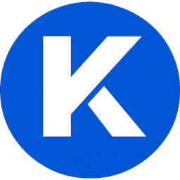

<p align="center">
  <a href="https://www.kangentic.com"></a>
</p>

<h1 align="center"><a href="https://www.kangentic.com">Kangentic</a></h1>

<p align="center">
  <strong>Visual Agent Orchestration for Claude Code</strong>
</p>

<p align="center">
  <a href="https://www.npmjs.com/package/kangentic"></a>
  <a href="https://github.com/Kangentic/kangentic/releases/latest"></a>
  <a href="LICENSE"></a>
  
  <a href="https://www.kangentic.com"></a>
  <a href="https://github.com/Kangentic/kangentic/stargazers"></a>
</p>

---

<p align="center">One board to manage all your Claude Code agents.</p>

<p align="center">Managing multiple Claude Code sessions with terminal tabs is chaotic. Kangentic replaces that with a drag-and-drop board where every column transition controls agent lifecycle automatically. Free to use, fully local, no accounts required.</p>

<p align="center">
  <a href="https://www.kangentic.com"></a>
</p>

## Features

- **Visual agent orchestration** - drag tasks between columns to spawn, suspend, and resume Claude Code sessions automatically
- **Git worktree isolation** - each agent works on its own branch in a dedicated checkout, no merge conflicts between parallel agents
- **Built-in terminals** - full xterm.js terminals with WebGL rendering, per-session tabs, and drag-to-resize panels
- **Session persistence** - close the app, reopen it, resume right where you left off via `--resume`
- **Real-time activity detection** - see which agents are thinking, idle, or waiting for input with live tool call tracking, token usage, cost, and context window utilization
- **Concurrent session management** - set a max number of parallel agents with automatic queuing and launch as slots open
- **Customizable board** - configure columns with custom names, colors, icons, permission modes, auto-spawn rules, and transition actions
- **Shareable team config** - commit `kangentic.json` to version control so the whole team shares the same board layout, columns, and actions
- **Custom shortcuts** - add one-click buttons for editors (VS Code, Cursor, Zed), git tools, file browsers, or any shell command with template variables like `{{cwd}}` and `{{branchName}}`
- **Configurable settings** - appearance (10 themes), terminal (font, cursor, scrollback, shell selection), agent behavior (permissions, idle timeout, concurrency), git (worktrees, base branch, init scripts), and notifications
- **100% local** - all data stays on your machine with no accounts, no cloud sync, and no telemetry by default
- **Free and open source** - no subscriptions, no usage limits, no paid tiers
- **Cross-platform** - native installers for Windows, macOS, and Linux with support for PowerShell, bash, zsh, fish, nushell, WSL, and cmd

## How It Works

1. **Add tasks** to your board, describing the work in plain text
2. **Drag a task** into an active column. Kangentic spawns a Claude Code agent in an isolated git worktree.
3. **Watch progress** in the built-in terminal, or let it run and check back later
4. **Review and merge** when the agent finishes

## What Kangentic Is Not

- **Not a task tracker.** No sprints, story points, or backlog grooming. The board exists to control agents, not to manage project management metadata.
- **Not a CI system.** It does not run pipelines or deploy artifacts. It orchestrates interactive Claude Code sessions on your local machine.
- **Not a web API wrapper.** Kangentic spawns real terminal sessions with full PTY support via the Claude Code CLI directly.

## Prerequisites

- [Node.js](https://nodejs.org/) 20+ (for npx)
- [Claude Code](https://docs.anthropic.com/en/docs/claude-code)
- [Git 2.25+](https://git-scm.com/)

## Setup

```bash
npx kangentic
```

One command to download, install, and launch. After the first run, auto-updates handle everything.

For more details, see the [Installation & Setup guide](https://www.kangentic.com/getting-started/).

## Documentation

Get started at [kangentic.com/getting-started](https://www.kangentic.com/getting-started/).

## Development

```bash
git clone https://github.com/Kangentic/kangentic.git
cd kangentic
npm install
npm start
```

See [CONTRIBUTING.md](CONTRIBUTING.md) for project structure, testing, and code style.

## Contributing

See [CONTRIBUTING.md](CONTRIBUTING.md) for guidelines. All contributors must sign a [CLA](CLA.md) before their first PR can be merged.

## Support

- [GitHub Discussions](https://github.com/Kangentic/kangentic/discussions) for questions and feature requests
- [GitHub Issues](https://github.com/Kangentic/kangentic/issues) for bug reports

## License

[AGPL-3.0](LICENSE). If AGPL doesn't work for you, drop us a line at licensing@kangentic.com.

---

<h4 align="center">Built with</h4>

<p align="center">
  
  
  
  
  
  
  
  
</p>
